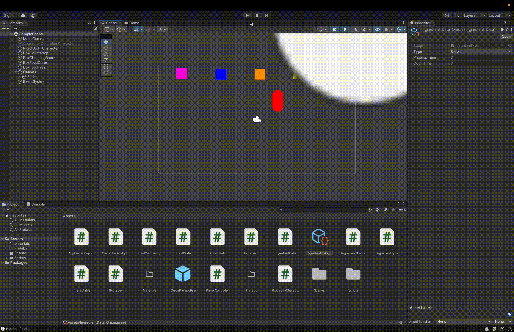

# Overcooked2D

Inspired by Overcooked. Motivated to learn top-down 2D game development in Unity.

## GamePlay
### Controls
Ctrl - Chop/Throw
Space - Pick Up/Drop
Arrow Keys / WASD - Movement   

### Orders

## Core Mechanics
- `PlayerController`
- `Interactable` abstract class

## ChangeLog
Here is a basic tracking of the versioning system.

### V1: Basic Game Mechanics
First implemented the basic game mechanics, including:
- Ingredient crate where player can pick up an ingredient
- Table where a player can place and pick up an ingredients
- ChoppingBoard where a player can place, chop (with basic slider animation), and pick up an ingredient.
- Trash where a player can throw out an ingredient.
- Player can drop food onto the floor

### V2: Player Mechanics and More Game Mechanics
- Improved imput system with 
- Player movement (facing direction, dash)
- Washing Dishes
  
### V3: Basic Pixel Art and Animations

### V4: Start UI and Level System

### V5: ...