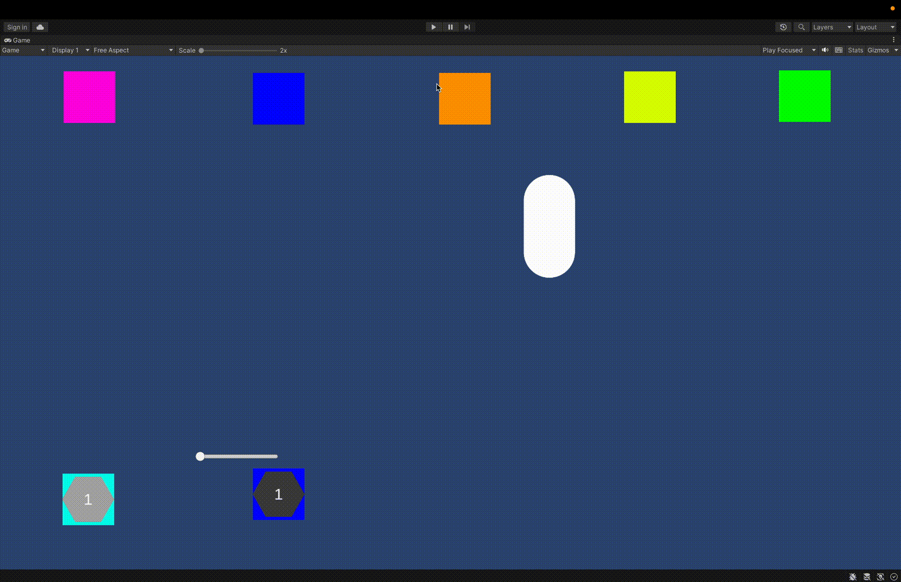
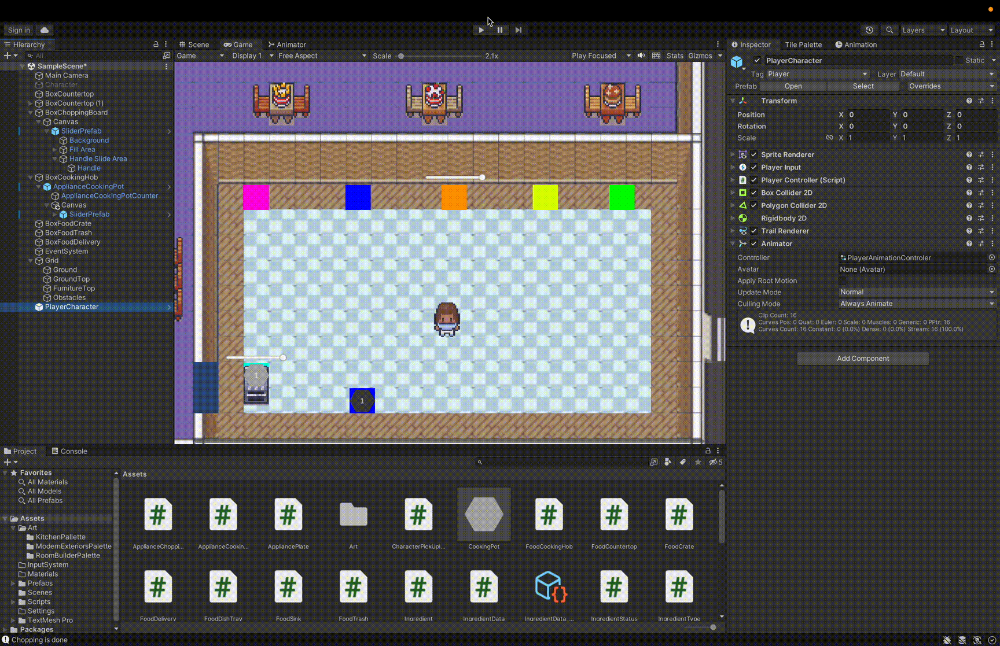
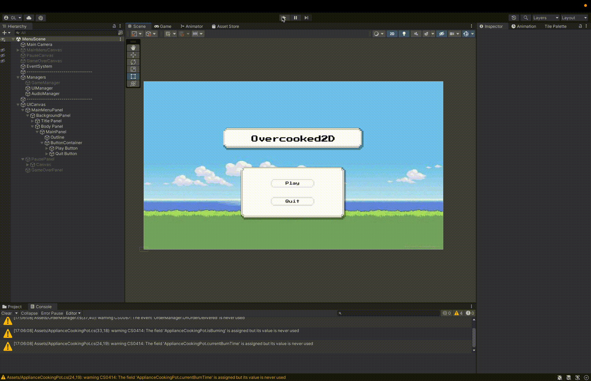

# Overcooked2D

Inspired by Overcooked. Motivated to learn top-down (isometric) 2D game development in Unity.

## GamePlay
### Controls
- Chop/Wash - R
- Pick Up/Drop - Space
- Emote - Keyboard E
- Dash - Keyboard F
- Arrow Keys / WASD - Movement   

TODO
- Throw

### Orders

## Core Mechanics
- `PlayerController`
- `Interactable` abstract class

## TODO
- Combining ingredients
- Multiple levels
- 

## ChangeLog
Here is a basic tracking of the versioning system.

### V1: Basic Game Mechanics
First implemented the basic game mechanics, including:
- Ingredient crate where player can pick up an ingredient
- Table where a player can place and pick up an ingredients
- ChoppingBoard where a player can place, chop (with basic slider animation), and pick up an ingredient.
- Trash where a player can throw out an ingredient.
- Player can drop food onto the floor

Here is a demo.

### V2: More Game Mechanics and Player Mechanics
- Improved imput system with `Unity.InputSystems` and dash implementation
- Generalize Ingredient and Appliance to `IPickable` Class
- Ingredients can be placed into cooking pots and then onto stoves (hobs) for cooking
- Ingredients can be placed into plates (taken from stove, ingredients directly, from another plate)
- Ingredeints in cooking pots and plates can be thrown out into trash.

Here is a demo where blue box is ingredient crate, blue is countertop, orange is chopping board, yellow is trash, and light blue is hob. The light hexagon is stove and dark hexagon is plate.

### V3 Basic Pixel Art and Basic UI Components
- Incoprorate ModernX PixelArt for 4 directional player movement + idle with Blend Tree and Animator
- ModernX PixelArt to imagine what the gameplay will be like.
- Cooking/Cutting progress slider located above the objects (Cutting Table and Cooking Table)

Here is the demo. Game mechanics still the same. 

### V4: Main Menu, Order Mechanics and Order UI
- Main Menu (Start Game)
- GameManager (Singleton), OrderManager, UIManager to facilitate game flow. Simple, press play to load level 1.1
- Pause/Unpause Game
- Order Mechanics (LevelData, OrderData)
- Level Canvas (Order UI, Countdown UI, and Score UI)

In this demo, I mostly focused on understanding how to implement game logic and switching between scenes. Learned how to use a Singleton class, better understanding of `delegate` and `events`, as well as `coroutines`. Here is a demo.

### V5: Finish Gameplay Mechanics for Level1 + Art/Animation
Cooking animation ()
Interactable Object Arts (Stove, Countertop, Chopping Board)
Submit Order (And Calculate Score)
Onion Soup

### V6: Level Selection, Level Progression, etc...
Add two levels 
- Onlion Soup
- Burgers

### V7: Building and Exporting the Game

